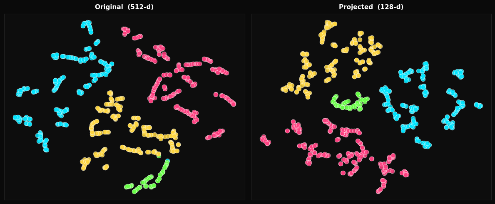

# Face Recognizer

Real-time face recognition module for **[LYNX DMS](url)**, built on top of InsightFace ArcFace R50 with a custom-trained MLP adapter that refines the embedding space for the enrolled set.

> Face detection and landmark pipeline provided by **[FaceDetector](https://github.com/asem-sharif-ai/FaceDetector)** — published separately.
---

## The Problem

ArcFace R50 was trained on 600k identities and produces strong 512-d embeddings — but when deployed on a small closed set (4–10 persons), two issues arise:

- **High intra-class variance** — the same person looks different across lighting, angles, and expressions, causing loose spread-out clusters
- **Insufficient inter-class separation** — some person pairs sit too close in raw embedding space, risking false matches

A fixed cosine threshold on raw embeddings is fragile under these conditions.



## The Solution

A lightweight two-layer MLP adapter (`Linear(512→256, ReLU) → Linear(256→128)`) is trained on the enrolled set using **Online Hard Triplet Loss**. It learns a projection from ArcFace's generic 512-d space into a 128-d space optimised for the specific people in the database — tightening intra-class clusters and pushing inter-class pairs apart.

The adapter is re-trained whenever the enrolled set changes (add or remove a person). Inference cost is negligible: two matrix multiplications on a 512-d vector.

### Results on a 4-person set

```
─────────────────────────────────────────────────────────
      INTRA-CLASS  (higher = tighter cluster)
─────────────────────────────────────────────────────────
Person            Original   Projected    Delta
─────────────────────────────────────────────────────────
arwa                0.5694      0.8993  +0.3299 ▲
hossam              0.4805      0.9050  +0.4245 ▲
rowaida             0.6403      0.8764  +0.2361 ▲
zeinab              0.4374      0.8743  +0.4369 ▲

─────────────────────────────────────────────────────────
      INTER-CLASS  (lower = better separation)
─────────────────────────────────────────────────────────
Pair                      Original   Projected    Delta
─────────────────────────────────────────────────────────
arwa ↔ hossam               0.2878      0.1304  -0.1574 ▼
arwa ↔ rowaida              0.4101      0.0260  -0.3841 ▼
arwa ↔ zeinab               0.6283      0.0581  -0.5702 ▼
hossam ↔ rowaida            0.3637      0.4166  +0.0529 ▲  (this gallery had only 49 image)
hossam ↔ zeinab             0.4280      0.1785  -0.2495 ▼
rowaida ↔ zeinab            0.5123      0.1619  -0.3504 ▼
─────────────────────────────────────────────────────────
```

Intra-class similarity improves by **+0.35 on average**. Inter-class pairs that were dangerously close in raw space (arwa ↔ zeinab at 0.63) are pushed well below threshold after projection.

---

## Architecture

```
BGR Frame
    │
    ▼
┌─────────────────────────────┐
│  Detector  (MediaPipe FM)   │  478-point mesh · bbox · alignment
└────────────────┬────────────┘
                 │ aligned 112×112 RGB
                 ▼
┌─────────────────────────────┐
│  Embedder  (ArcFace R50)    │  ONNX · 512-d L2-normalized
└────────────────┬────────────┘
                 │ raw 512-d embedding
                 ▼
┌─────────────────────────────┐
│  Adapter   (MLP 512→128)    │  trained per enrolled set · optional but critical
└────────────────┬────────────┘
                 │ projected 128-d embedding
                 ▼
┌─────────────────────────────┐
│  WhitelistDB  (SQLite)      │  cosine match · top-3 mean similarity
└────────────────┬────────────┘
                 │
                 ▼
            Recognition Result
```

---

## Components

### `Recognizer` — main interface

| Method | Description |
|---|---|
| `meet(name, frames, chat_id, password, callback)` | Enrol a person from a list of BGR frames |
| `forget(user_id)` | Remove a person and invalidate the adapter |
| `tune(epochs, margin, lr, batch_size, callback)` | Retrain the MLP adapter on current enrolled set |
| `look(frame)` | Run one frame through the recognition pipeline |
| `reset()` | Clear the embedding buffer |
| `pad_status()` | Liveness decision from the PAD buffer |
| `list` | All enrolled users as `[{id, name, chat_id, embedding_count}]` |

`look()` is designed to be called on a stream. Results stabilise after the embedding buffer fills (15–30 frames by default). The return dict:

```python
{
    'located'    : bool,     # face detected in frame
    'decided'    : bool,     # enough buffer to decide
    'known'      : bool,     # matched above threshold
    'id'         : str,      # matched user ID
    'name'       : str,      # matched display name
    'chat_id'    : int,      # Telegram chat ID
    'confidence' : float,    # cosine similarity (0–1)
    'pad'        : bool,     # anti-spoof flag
    'pad_score'  : float,    # liveness score (0–1)
}
```

### `_Adapter` — MLP projection layer

Trained with **Online Hard Triplet Loss** + Adam. Hard mining selects the furthest same-class pair (hard positive) and the nearest different-class pair (hard negative) per batch to focus gradient on difficult examples. He initialisation for ReLU layers. Saves/loads weights as `adapter.npz`.

Must be retrained (via `tune()`) after any enrolment change.

### `_Embedder` — ArcFace ONNX

Wraps `w600k_r50.onnx` from InsightFace's buffalo_l pack. Auto-downloads on first run. Input: aligned 112×112 RGB. Output: L2-normalized 512-d float64 vector. Uses `NNAPIExecutionProvider` on compatible ARM devices (Raspberry Pi), falls back to CPU.

### `WhitelistDB` — SQLite identity store

Two-table schema: `users` (id, name, chat_id, password_hash) and `embeddings` (user_id → binary blob). Sequential two-digit IDs (`00`, `01`, …). Includes an `Admin` user seeded on first init. Password stored as MD5 hash.

| Method | Description |
|---|---|
| `add_user(name, chat_id, password)` | Add or update a user, return their ID |
| `remove_user(user_id)` | Delete user and all their embeddings |
| `add_embeddings(user_id, vectors)` | Bulk insert embedding vectors |
| `all_embeddings()` | `{name: [emb, ...]}` — used by adapter training |
| `all_users()` | Full user list with embedding counts |
| `get_by_id(user_id)` | Single user with all embeddings |
| `verify_password(user_id, plaintext)` | Credential check |
| `reset_password(user_id, new_password)` | Update stored hash |

---

## Quick Start

```python
from whitelist   import WhitelistDB
from recognizer  import Recognizer

db  = WhitelistDB('whitelist.db')
rec = Recognizer(database=db, threshold=0.75, buffer_size=20)

# Enrol
frames = [...]   # list of BGR frames, one face per frame
rec.meet('Asem', frames, chat_id=123456, password='pass', callback=print)

# Retrain adapter after enrolment
rec.tune(epochs=30, margin=0.35)

# Recognition loop
import cv2
cap = cv2.VideoCapture(0)
while True:
    ok, frame = cap.read()
    result = rec.look(frame)

    if result['decided']:
        if result['known']:
            print(f"Welcome {result['name']}  ({result['confidence']:.2f})")
        else:
            print('Unknown')
```

---

## Configuration

```python
Recognizer(
    database    = WhitelistDB(),  # SQLite backend
    use_adapter = True,           # apply MLP projection
    buffer_size = 30,             # frames averaged per decision
    threshold   = 0.75,           # cosine similarity cutoff
)
```

Threshold guide for ArcFace 512-d:

| Range | Effect |
|---|---|
| `0.80+` | Strict — fewer false accepts, more unknowns |
| `0.70–0.80` | Balanced — recommended starting point |
| `< 0.70` | Lenient — higher false positive risk |

With the adapter active, effective similarity scores shift upward for known persons, so a threshold of `0.75` operates more conservatively than it would on raw embeddings.

---

## Module Structure

| File | Role |
|---|---|
| `detector.py` | MediaPipe face detection and face alignment |
| `pad_engine.py` | Passive liveness detection |
| `recognizer.py` | Top-level API — enrolment, tuning, recognition |
| `embedder.py` | ArcFace R50 ONNX — 512-d embedding |
| `adapter.py` | MLP adapter — 512-d → 128-d projection |
| `whitelist.py` | SQLite — users, embeddings, passwords |
| `normalize.py` | L2 normalisation utilities |

---

## Requirements

```
onnxruntime
insightface
scipy
numpy
mediapipe
```

Model files required at runtime:

| File | Source |
|---|---|
| `detector.task` | MediaPipe FaceLandmarker |
| `genderage.onnx` | Used in Detector |
| `w600k_r50.onnx` | Auto-downloaded from InsightFace buffalo_l on first run |
| `adapter.npz` | Generated by `tune()` — not required on first launch |

> `w600k_r50.onnx` is downloaded automatically on first run by instantiating a `Recognizer` object — no manual setup required. `detector.task` and `genderage.onnx` must be downloaded manually from the link above.

---

## Project Context

This module was originally implemented as the **perception layer** for **[Lynx DMS](https://github.com/asem-sharif-ai/Lynx-DMS)** — an Intelligent Edge Deployed Driver Monitoring System developed as a graduation project at the Faculty of Artificial Intelligence, Menoufia University (Spring 2026).

The recognizer serves as the first security and logging layer on the edge device: only enrolled, verified drivers are granted access, and every recognition event is logged and forwarded via chat bot — which is why `chat_id` is a first-class field in the database schema rather than optional metadata.

For general use, `chat_id` can map to anything that identifies a notification target — phone number, webhook ID, email handle, or left as `0` if alerting is not needed.

Designed to run in a background threads — all methods are stateful but contain no Qt dependencies, so they can be wrapped in any threading model.
